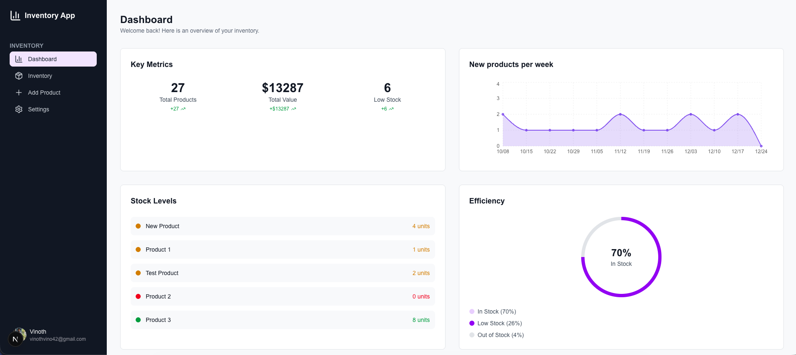

# Inventory App

An open-source inventory management system built with Next.js, Prisma, and Stack Auth. Easily track products, monitor stock levels, and gain insights with a modern dashboard.

## Features

- User authentication (Stack Auth)
- Dashboard with product statistics and charts
- Add, edit, and delete products
- Inventory search and pagination
- Responsive sidebar navigation
- Modern UI with Tailwind CSS

## Screenshot



## Tech Stack

- [Next.js](https://nextjs.org/) (App Router)
- [Prisma](https://www.prisma.io/) ORM & PostgreSQL
- [Stack Auth](https://stackframe.dev/) for authentication
- [Tailwind CSS](https://tailwindcss.com/) for styling
- [Recharts](https://recharts.org/) for data visualization

## Getting Started

1. **Install dependencies:**

   ```bash
   npm install
   # or
   yarn install
   ```

2. **Set up environment variables:**

   - Copy `.env.example` to `.env` and set your `DATABASE_URL` (PostgreSQL) and Stack Auth keys.

3. **Run database migrations:**

   ```bash
   npx prisma migrate dev --name init
   ```

4. **Seed the database (optional):**

   ```bash
   npx tsx prisma/seed.ts
   ```

5. **Start the development server:**
   ```bash
   npm run dev
   ```
   Open [http://localhost:3000](http://localhost:3000) in your browser.

## Project Structure

- `app/` — Next.js app directory (pages, layouts, routes)
- `components/` — Reusable UI components
- `lib/` — Auth, Prisma, and server actions
- `prisma/` — Prisma schema and seed script

## Credits

[YouTube - NextJS 16 FullStack Course - Build an Inventory Management Website](https://www.youtube.com/watch?v=L5CsIkO5xv4&t=845s)
